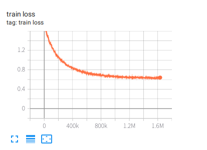
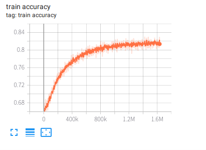
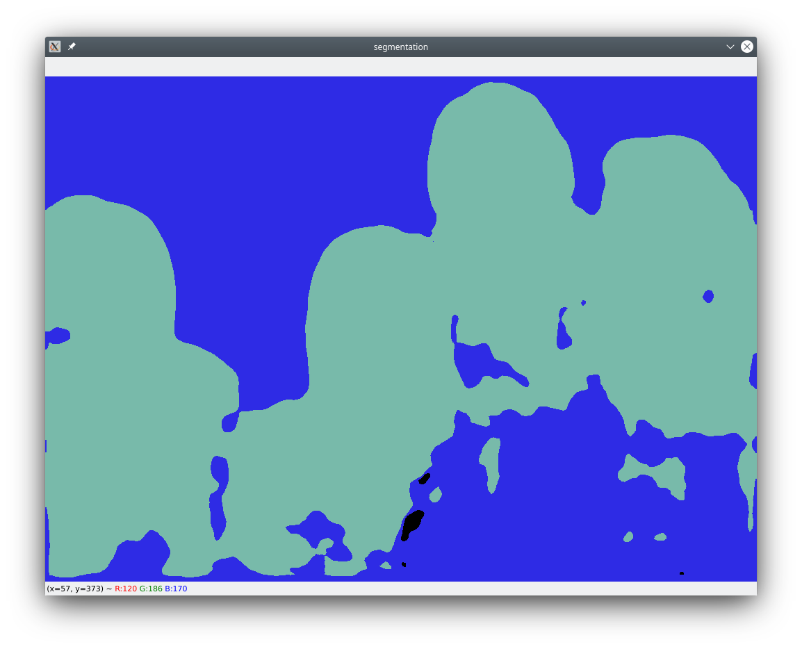
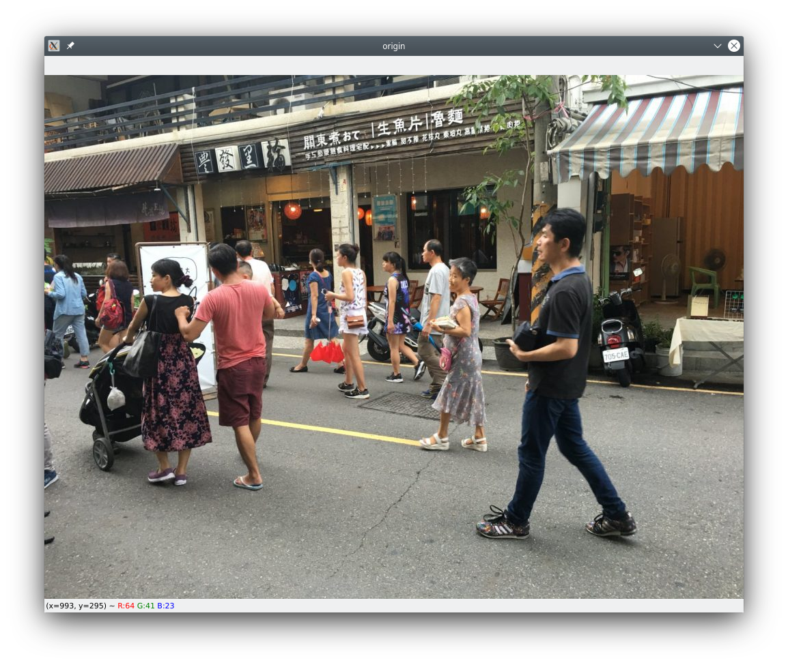
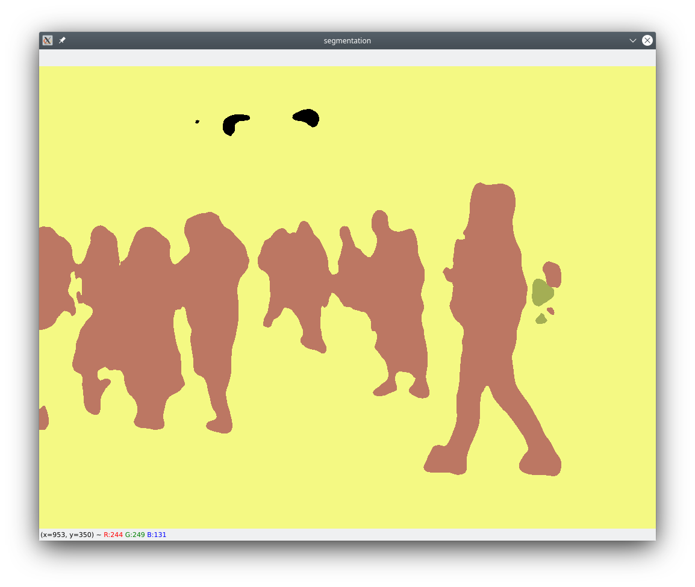

# DeeplabV3-tf2.0
This project implements the SOTA image segmentation algorithm deeplab V3+ with tensorflow2

## dataset preparation

download COCO2017 dataset from [here](https://cocodataset.org/). unzip directory train2017, val2017 and annotations. generate dataset with the following command.

```python
python3 create_dataset.py </path/to/train2017> </path/to/val2017> </path/to/annotations>
```

upon executing the script successfully, there will directory trainset and testset generated under the root directory of the source code.

## train with dataset

train with multiple GPU with executing command

```python
python3 train_eager_distributed.py
```

train with single GPU with executing command

```python
python3 train_eager.py
```

or 

```python
python3 train_keras.py
```

## save model

save model with command

```python
python3 save_model.py
```

## experimental results

here are some results of my model which can be downloaded [here](https://pan.baidu.com/s/1qa7hHPr77syvP2wdbOMdrQ), pass code is **nh9u**. note that "bad marshal data (unknown type code)" error occurs when you load the model file deeplabv3plus.h5 with python3.7 or above version. the model is saved with python 3.6.9. you can load weights file deeplabv3plus_weights.h5 with any version of python.

<p align="center">
  <table>
    <caption>Loss</caption>
    <tr><td></td></tr>
    <tr><td></td></tr>
  </table>
</p>
<p align="center">
  <table>
    <caption>Segmentation results</caption>
    <tr>
      <td></td>
      <td></td>
    </tr>
    <tr>
      <td></td>
      <td></td>
    </tr>
  </table>
</p>

## how to predict with the trained model

